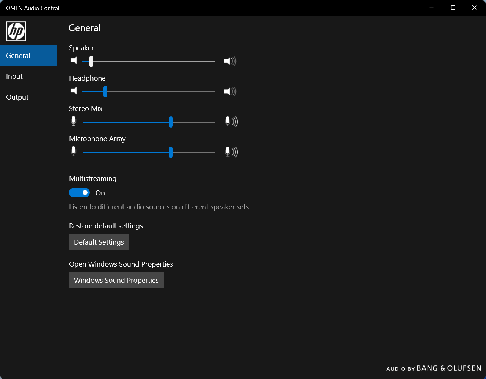
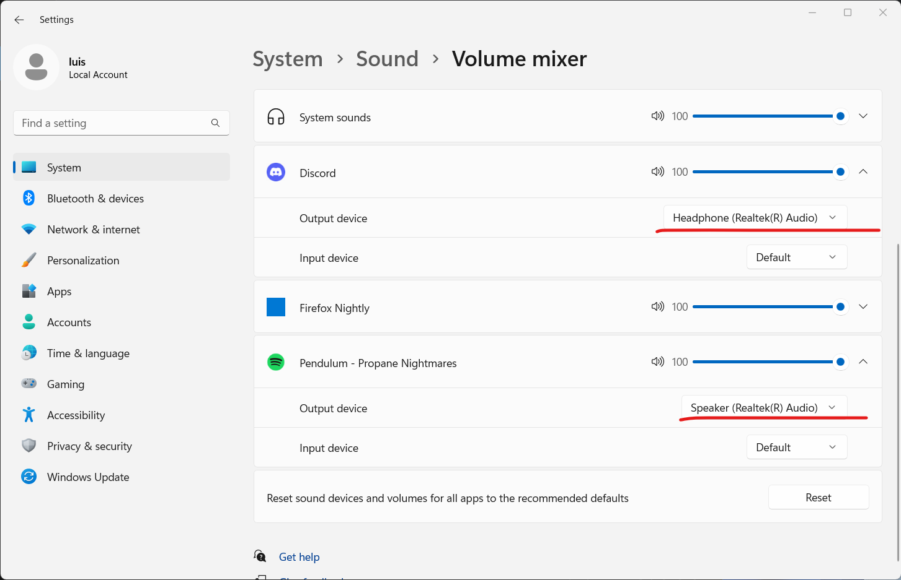
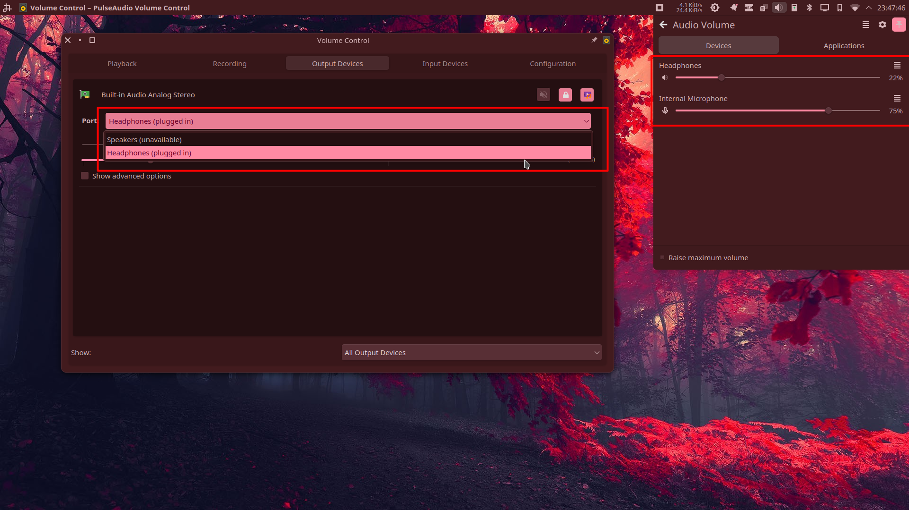
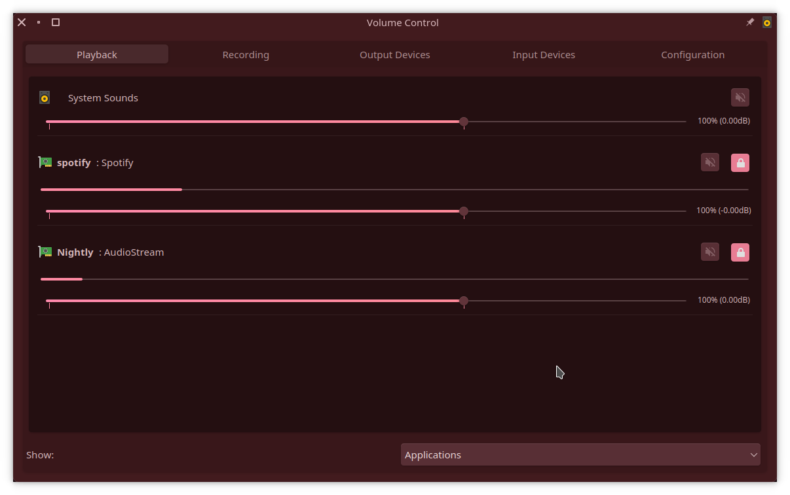
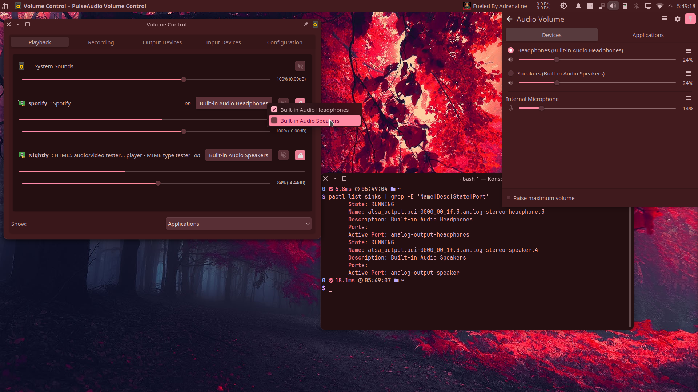
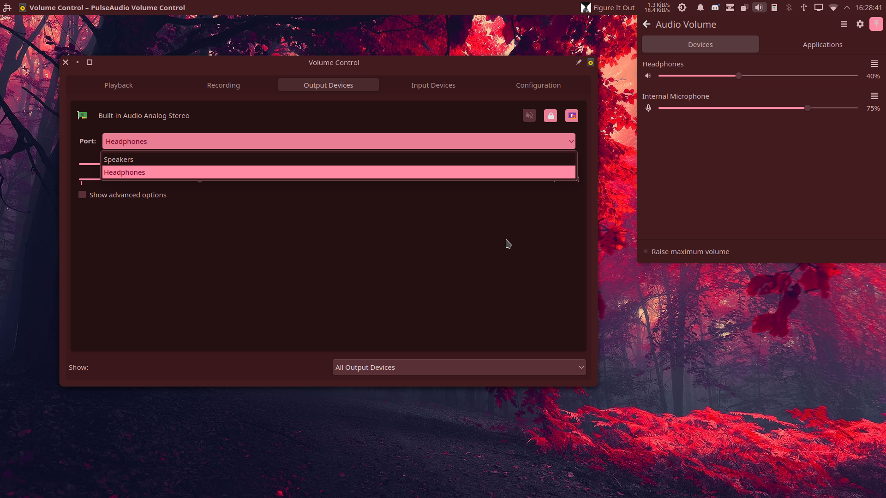
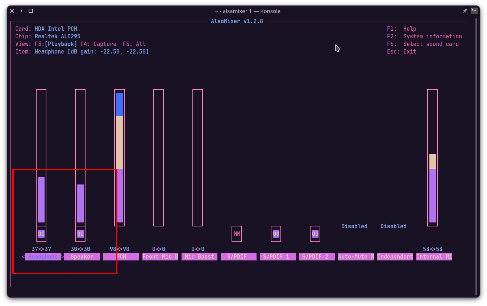
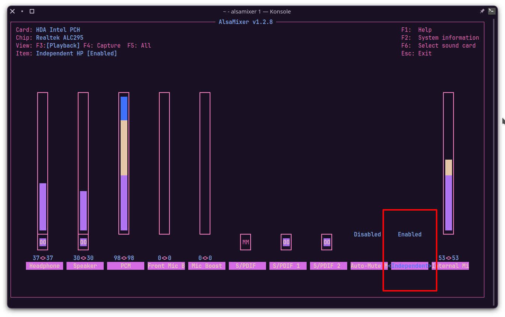

# [Guide] Splitting audio ports in Linux for simultaneous playback

## Introduction
On windows some laptops have the option to enable the playback of different
audio streams on different audio outputs, for example you could listen to a
video call in the browser through your wired headphones, while playing music
from Spotify on the internal speakers.

Such option can have a different name depending on the sound card or laptop's 
vendor, for my laptop, an **HP Omen 15-dc100xxx with a ALC295 card** it is called `multistreaming`
an can be enabled from the **OMEN Audio Control** program.

Here's some screenshot showcasing that feature on Windows (11)



And this is how you route programs' audio to an individual output



### On Linux I don't have such an option, so can only listen one output at a time
That is:
- You have to unplug your wired speakers/headphones to be able to play anything from the internal speakers,
- And if you connect a wired speakers/headphones:
  -  The internal speaker is muted, hidden from the gui and marked as unavailable
        
        
  -  Audio streams are switched to your wired output without giving you the desired output option like windows does
        
        

## The final result
- Allow selecting and playing audio from the internal speakers while a wired output is connected
- Play different audio streams on each card port, simultaneously
- Have a separate audio sink for each output



**NOTE: The program used in above screenshots is pavucontrol**

# Requirements:
- PipeWire
- alsa-utils
- pavucontrol (optional)

# 1 Preparations, analyze how the card appears on Linux

## 1.1 Gather some information about the card and the available audio sinks

Run `pactl list cards` and save the output somewhere, bellow is a stripped
 version of mine to keep the important things

```yaml
Card #46
        Name: alsa_card.pci-0000_00_1f.3
        Driver: alsa
        ...
        Profiles:
                output:analog-stereo+input:analog-stereo: Analog Stereo Duplex (sinks: 1, sources: 1, priority: 6565, available: yes)
                output:analog-stereo: Analog Stereo Output (sinks: 1, sources: 0, priority: 6500, available: yes)
                input:analog-stereo: Analog Stereo Input (sinks: 0, sources: 1, priority: 65, available: yes)
                pro-audio: Pro Audio (sinks: 4, sources: 1, priority: 1, available: yes)
        Active Profile: output:analog-stereo+input:analog-stereo
        Ports:
                analog-output-speaker: Speakers (type: Speaker, priority: 10000, latency offset: 0 usec, availability group: Legacy 3, availability unknown)
                        Properties:
                                port.type = "speaker"
                                port.availability-group = "Legacy 3"
                                device.icon_name = "audio-speakers"
                                card.profile.port = "2"
                        Part of profile(s): output:analog-stereo, output:analog-stereo+input:analog-stereo
                analog-output-headphones: Headphones (type: Headphones, priority: 9900, latency offset: 0 usec, availability group: Legacy 4, availability unknown)
                        Properties:
                                port.type = "headphones"
                                port.availability-group = "Legacy 4"
                                device.icon_name = "audio-headphones"
                                card.profile.port = "3"
                        Part of profile(s): output:analog-stereo, output:analog-stereo+input:analog-stereo
```
**Card details**
```yaml
Name: alsa_card.pci-0000_00_1f.3
Ports: analog-output-speaker analog-output-headphones
Profiles: output:analog-stereo input:analog-stereo output:analog-stereo+input:analog-stereo
```
As we can see, this laptop has three audio profiles, one for all audio outputs 
and other for all inputs, with an extra one that has both inputs and outputs (yours may vary)

## 1.2 Inspect the audio sinks available for our sound card

Run `pactl list sinks` and save the output, bellow is a stripped
version of mine to keep the important things

```yaml
Sink #47
        State: RUNNING
        Name: alsa_output.pci-0000_00_1f.3.analog-stereo
        Description: Built-in Audio Analog Stereo
        Driver: PipeWire
        Sample Specification: s32le 2ch 48000Hz
        Channel Map: front-left,front-right
        Owner Module: 4294967295
        Mute: no
        Volume: front-left: 13763 /  21% / -40.67 dB,   front-right: 13763 /  21% / -40.67 dB
                balance 0.00
        Base Volume: 65536 / 100% / 0.00 dB
        Monitor Source: alsa_output.pci-0000_00_1f.3.analog-stereo.monitor
        Latency: 0 usec, configured 0 usec
        Flags: HARDWARE HW_MUTE_CTRL HW_VOLUME_CTRL DECIBEL_VOLUME LATENCY 
        Properties:
                ...
        Ports:
                analog-output-speaker: Speakers (type: Speaker, priority: 10000, availability group: Legacy 3, not available)
                analog-output-headphones: Headphones (type: Headphones, priority: 9900, availability group: Legacy 4, available)
        Active Port: analog-output-headphones
        Formats:
                pcm
```
**Sink details**
```yaml
Name: alsa_output.pci-0000_00_1f.3.analog-stereo
Ports: analog-output-speaker analog-output-headphones
Active Port: analog-output-headphones
```
As we can see, there is only one audio sink that can play audio on the two outputs individually (yours may vary)

# 2 disable Headphone jack detection for speakers
To do this we need to modify the alsa card profile for the speakers port which in my case is `analog-output-speaker`

Open the file `/usr/share/alsa-card-profile/mixer/paths/` + `your-output-name` + `.conf` 

- Set `state.plugged = unknown` inside the `[Jack ...]` section that best matches the wired port name of your card in my case is `analog-output-headphones`:
```ini
[Jack Headphone]
state.plugged = unknown
state.unplugged = unknown
```
- Comment (by adding semi-colon on start of line) the `[Element ...]` that matches the selected `[Jack ...]`
```ini
; [Element Headphone]
; switch = off
; volume = off
```

Now restart the audio server by running: 
```sh
systemctl restart --user pipewire pipewire-pulse pipewire.socket wireplumber
```

If everything went well you should have the speaker option available without having to unplug your wired device and 
- Should be able to play audio on them (individually)
- Audio streams should still change automatically from speakers to your wired output and viceversa when plugging/unplugging a wired device



Good we're closer to our final goal, but you can stop here if this was your desired behavior...

# 3 Patching the HD-Audio driver

## 3.1 Analyze the card Subdevices 
First we need to identify and check if our card has more than one subdevice and test if sound comes out of them

Run 
```sh
aplay -l
```

You'll get something like the following

```ini
**** List of PLAYBACK Hardware Devices ****
card 0: PCH [HDA Intel PCH], device 0: ALC295 Analog [ALC295 Analog]
  Subdevices: 1/1
  Subdevice #0: subdevice #0
...
```

At this point, my card `card 0` (ALC295), has only one subdevice, you may have more, take note of this information as we'll need it later

We can confirm the playback (output) and capture (input) streams the card currently has with `cat /proc/asound/pcm`

```yaml
00-00: ALC295 Analog : ALC295 Analog : playback 1 : capture 1
...
```

## 3.2 Making the patch file

Run 
```sh
cat /proc/asound/card*/codec#* | grep -E 'Codec|Vendor Id|Subsystem Id|Address'
```
You'll get something like the following

```yaml
Codec: Realtek ALC295
Address: 0
Vendor Id: 0x10ec0295
Subsystem Id: 0x103c8575
Codec: Intel Kabylake HDMI
Address: 2
Vendor Id: 0x8086280b
Subsystem Id: 0x80860101
```
Realtek ALC295 is my sound card, the other is from the HDMI outputs

With the above we can start our patch file, which will have the following structure (don't copy as is, read explanation below)

```ini
[codec]
0x10ec0295 0x103c8575 0

[hints]
indep_hp=1
vmaster=no
```
Below the line `[codec]` we should put the values of `vendor id`, the `subsystem id` and `address` in one line of the card, separated by spaces.

Below `[hints]` we need to add what what is called hint strings

- `indep_hp=yes` this will make for our jack output to be detected as an independent PCM stream with its own controls

- `vmaster=no` will disable the virtual Master control so we can control volume on each device individually

With our patch file ready it's time to add it to our system

Create these two files:

`/etc/modprobe.d/alsa-base.conf`
```sh
options snd-hda-intel patch=alc-sound-patch.fw
```
`/lib/firmware/alc-sound-patch.fw`

```ini
[codec]
0x10ec0295 0x103c8575 0

[hints]
indep_hp=1
vmaster=no
```

**Reboot to apply the changes**

Run again
```sh
aplay -l
```

You'll get something like the following

```ini
**** List of PLAYBACK Hardware Devices ****
card 0: PCH [HDA Intel PCH], device 0: ALC295 Analog [ALC295 Analog]
  Subdevices: 0/1
  Subdevice #0: subdevice #0
card 0: PCH [HDA Intel PCH], device 2: ALC295 Alt Analog [ALC295 Alt Analog]
  Subdevices: 1/1
  Subdevice #0: subdevice #0
```
Now the card `card 0` (ALC295), has an extra subdevice, interesting...

We can confirm the playback (output) and capture (input) streams the card now has with `cat /proc/asound/pcm`

```yaml
00-00: ALC295 Analog : ALC295 Analog : playback 1 : capture 1
00-02: ALC295 Alt Analog : ALC295 Alt Analog : playback 1
...
```

Let's try to play something on them shall we?

Plug-in your wired audio device then run `alsamixer -c0` (replace 0 with your card #number) and un-mute any muted device (the ones MM below the volume slider) pressing `m` and increase their volume to around 30 if the're on 0 then exit (press `Esc`)



Run `speaker-test -Dhw:0,0 -c2` (replace 0,0 with the card #number and device #numbers from your card)

For the device 0 (speaker-test -Dhw:0,0 -c2) I get the following and the sound comes out from the speakers, so `device 0 = speakers`

```sh
speaker-test 1.2.8

Playback device is hw:0,0
Stream parameters are 48000Hz, S16_LE, 2 channels
Using 16 octaves of pink noise
Rate set to 48000Hz (requested 48000Hz)
Buffer size range from 64 to 1048576
Period size range from 32 to 524288
Using max buffer size 1048576
Periods = 4
was set period_size = 262144
was set buffer_size = 1048576
 0 - Front Left
 1 - Front Right
Time per period = 10.930565
```
Repeat for all the devices for your card and note which device corresponds to which physical output

But you may I get the following error:

```sh
speaker-test 1.2.8

Playback device is hw:0,2
Stream parameters are 48000Hz, S16_LE, 2 channels
Using 16 octaves of pink noise
Playback open error: -16,Device or resource busy
```

This is because we have added `indep_hp` in the firmware patch but is not enabled by default

Run `alsamixer` and enable `Independent HP`, then try again.




Save these configs with the command `sudo alsactl store`

They will be saved in `/var/lib/alsa/asound.state`


So my card's outputs are the following (yours will vary):

- `0,0` Speakers (also handles microphones)
- `0,2` Headphones

# 4 Making a custom alsa profile for our card

## 4.1 Make a new udev rule for the future profile of the card

Create the file `/lib/udev/rules.d/91-pipewire-alsa.rules` (don't copy as is, read explanation below)

```sh
SUBSYSTEM!="sound", GOTO="pipewire_end"
ACTION!="change", GOTO="pipewire_end"
KERNEL!="card*", GOTO="pipewire_end"

SUBSYSTEMS=="pci", ATTRS{vendor}=="0x8086", ATTRS{device}=="0xa348", ENV{ACP_PROFILE_SET}="my-profile.conf"

LABEL="pipewire_end"
```

You need to replace the vendor and device ids but leaving the 0x that precedes each, you can get them from by running `lcpci --nn`

```yaml
00:1f.3 Audio device [0403]: Intel Corporation Cannon Lake PCH cAVS [8086:a348] (rev 10)
```

_vendor id is the first element between the square brackets and separated by a colon, second element is the device id_

## 4.2 Making the custom profile for the card
## Now is time to do a recap of all information we have captured

**Card details**
```yaml
Name: alsa_card.pci-0000_00_1f.3
Ports: analog-output-speaker analog-output-headphones
Profiles: output:analog-stereo input:analog-stereo output:analog-stereo+input:analog-stereo
```

**Sink details**
```yaml
Name: alsa_output.pci-0000_00_1f.3.analog-stereo
Ports: analog-output-speaker analog-output-headphones
Active Port: analog-output-headphones
```

**Card subdevices and captures/outputs location**
```ini
**** List of PLAYBACK Hardware Devices ****
card 0: PCH [HDA Intel PCH], device 0: ALC295 Analog [ALC295 Analog]
  Subdevices: 0/1
  Subdevice #0: subdevice #0
card 0: PCH [HDA Intel PCH], device 2: ALC295 Alt Analog [ALC295 Alt Analog]
  Subdevices: 1/1
  Subdevice #0: subdevice #0
```

```yaml
00-00: ALC295 Analog : ALC295 Analog : playback 1 : capture 1
00-02: ALC295 Alt Analog : ALC295 Alt Analog : playback 1
...
```

So in my case I have:

- Two ports: `analog-output-speaker analog-output-headphones`
- Final port locations for the card 0
  - `0,0` Speakers (also handles microphones)
  - `0,2` Headphones

Now create the file `/usr/share/alsa-card-profile/mixer/profile-sets/my-profile.conf` and adapt it to your system according to the comments


```ini
; This will let alsa generate automatic profiles (e.g internal speaker + microphone)
[General]
auto-profiles = yes


; This is the mapping for the internal speaker change the 0,0 to your subdevice location
; You can change the description for this and other mappings if you want ;)
; in paths output put the name of the from card details
[Mapping analog-stereo-speaker]
description = Speakers
device-strings = hw:0,0
paths-output = analog-output-speaker
channel-map = left,right
direction = output

; This is the mapping for the jack output change the 0,2 to your subdevice location
; in paths output put the name of the from card details
[Mapping analog-stereo-headphone]
description = Headphones
device-strings = hw:0,2
paths-output = analog-output-headphones
channel-map = left,right
direction = output


; This is the mapping that will handle internal and external microphones, as you could see the Card subdevices and captures/outputs location also had a capture device in the 0,0 subdevice location so let's add it here too (change the 0,0 to your subdevice location)
; All the names here came from the default.conf profile set and you may have to adapt it if your input port name is not included

[Mapping analog-stereo-input]
description = Microphone
device-strings = hw:0,0
channel-map = left,right
paths-input = analog-input-front-mic analog-input-rear-mic analog-input-internal-mic analog-input-dock-mic analog-input analog-input-mic analog-input-linein analog-input-aux analog-input-video analog-input-tvtuner analog-input-fm analog-input-mic-line analog-input-headphone-mic analog-input-headset-mic
direction = input


; Broken in parts the profile name means to join
; The name of the Mapping containing the analog-output-headphones (output:analog-stereo-headphone)
; The name of the Mapping containing the analog-output-speaker (output:analog-stereo-speaker)
; The name of the Mapping containing the analog-stereo-input (input:analog-stereo-input)

; in output-mappings put the name of the output mappings
; input-mappings put the name of the input mappings

; NOTE: Not to be confused width the paths-output inside the mapping, we're not using those directly

; This is the profile that will have the internal speakers + jack output + all microphones
; in paths output put the name of the from card details
[Profile output:analog-stereo-headphone+output:analog-stereo-speaker+input:analog-stereo-input]
description = Analog Stereo Duplex
output-mappings = analog-stereo-headphone analog-stereo-speaker
input-mappings = analog-stereo-input
priority = 80

; This profile will have the internal speakers + jack output, but not microphones
[Profile output:analog-stereo-headphone+output:analog-stereo-speaker]
description = Analog Stereo Outputs Only
output-mappings = analog-stereo-headphone analog-stereo-speaker
priority = 70
```

**Reboot to apply the changes**

I everything went well you should have a separate audio sink for each output:

```sh
 pactl list sinks | grep -E 'Name|Desc|State|Port'
        State: RUNNING
        Name: alsa_output.pci-0000_00_1f.3.analog-stereo-headphone
        Description: Built-in Audio Headphones
        Ports:
        Active Port: analog-output-headphones
        State: IDLE
        Name: alsa_output.pci-0000_00_1f.3.analog-stereo-speaker
        Description: Built-in Audio Speakers
        Ports:
        Active Port: analog-output-speaker
```

# Credits & Resources
- Docs
  - [More Notes on HD-Audio Driver](https://docs.kernel.org/sound/hd-audio/notes.html)

[How to output unique audio to multiple ports/profiles of a PulseAudio card?](https://unix.stackexchange.com/questions/401492/how-to-output-unique-audio-to-multiple-ports-profiles-of-a-pulseaudio-card)